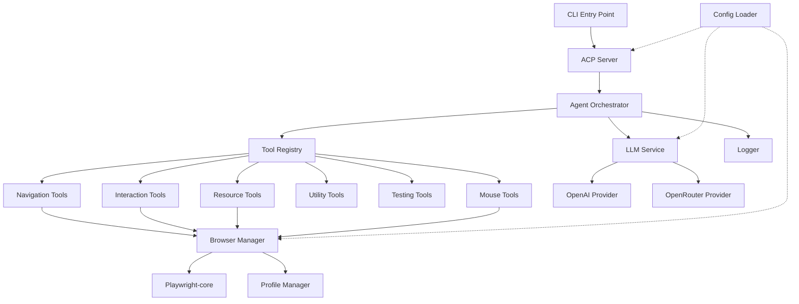
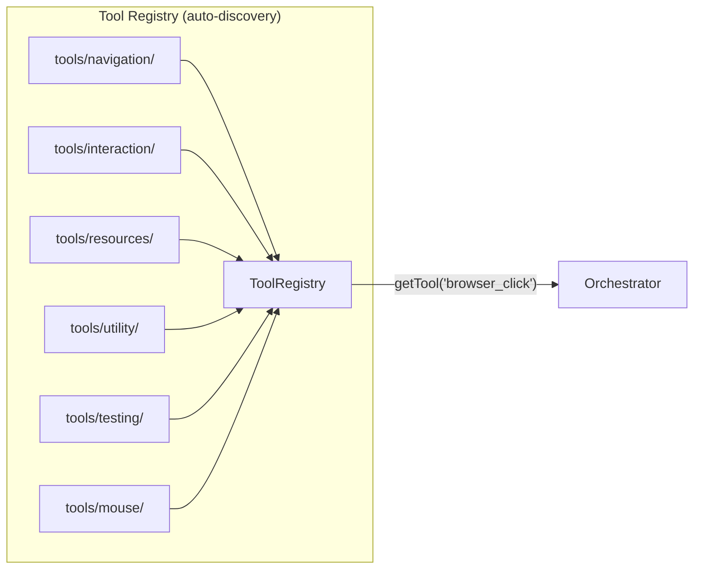

# Winky — Browser Automation Agent

An AI-powered browser automation agent built with **Playwright-core**, the **Agent Client Protocol (ACP) SDK**, and **OpenAI / OpenRouter** LLM providers. Uses a **plug-and-play tool architecture** inspired by `playwright-mcp`, implementing all 28 browser tools. Follows SOLID principles throughout.

---

## Architecture Overview



---

## Plug-and-Play Tool Architecture

Every browser action is a **Tool** — a self-contained class implementing a common `ITool` interface. Tools are auto-discovered and registered at startup. Adding a new tool = adding a new file in the `tools/` folder. No other code changes needed.

```typescript
// ITool interface (simplified)
interface ITool {
  name: string;              // e.g. "browser_click"
  description: string;       // Human-readable
  parameters: ZodSchema;     // Zod schema for validation
  readOnly: boolean;         // Whether the tool mutates state
  execute(params: unknown, context: ToolContext): Promise<ToolResult>;
}
```



---

## Complete Tool Catalog (28 Tools)

### 🧭 Navigation (3 tools)

| Tool | Description |
|------|-------------|
| `browser_navigate` | Navigate to a URL |
| `browser_navigate_back` | Go back in history |
| `browser_tabs` | List, create, close, or select tabs |

### 🖱️ Interaction (9 tools)

| Tool | Description |
|------|-------------|
| `browser_click` | Click element by accessibility ref (supports double-click, modifiers) |
| `browser_type` | Type text into editable element (supports slow typing, submit) |
| `browser_hover` | Hover over element |
| `browser_drag` | Drag and drop between elements |
| `browser_select_option` | Select dropdown option(s) |
| `browser_press_key` | Press keyboard key |
| `browser_fill_form` | Fill multiple form fields at once |
| `browser_handle_dialog` | Accept/dismiss browser dialogs |
| `browser_file_upload` | Upload file(s) |

### 📊 Resources (5 tools)

| Tool | Description |
|------|-------------|
| `browser_snapshot` | Capture accessibility tree snapshot (structured) |
| `browser_take_screenshot` | Screenshot (full page, viewport, or element) |
| `browser_console_messages` | Retrieve console logs by level |
| `browser_network_requests` | List network requests (filter static) |
| `browser_pdf_save` | Save page as PDF |

### 🔧 Utility (4 tools)

| Tool | Description |
|------|-------------|
| `browser_close` | Close the current page |
| `browser_resize` | Resize browser window |
| `browser_evaluate` | Execute JavaScript on page or element |
| `browser_run_code` | Run arbitrary Playwright code snippet |
| `browser_wait_for` | Wait for text/time/condition |
| `browser_install` | Install configured browser |

### 🧪 Testing (4 tools)

| Tool | Description |
|------|-------------|
| `browser_generate_locator` | Generate Playwright locator for element |
| `browser_verify_element_visible` | Verify element visible by role + name |
| `browser_verify_text_visible` | Verify text visible on page |
| `browser_verify_list_visible` | Verify list and its items visible |
| `browser_verify_value` | Verify element value (input, checkbox) |

### 🖱️ Low-Level Mouse (5 tools)

| Tool | Description |
|------|-------------|
| `browser_mouse_click_xy` | Click at x,y coordinates |
| `browser_mouse_move_xy` | Move mouse to x,y |
| `browser_mouse_drag_xy` | Drag from start to end coordinates |
| `browser_mouse_down` | Press mouse button down |
| `browser_mouse_up` | Release mouse button |
| `browser_mouse_wheel` | Scroll mouse wheel |

---

## Folder Structure

```
d:\winky\
├── src/
│   ├── index.ts                          # CLI entry point
│   ├── config/
│   │   ├── index.ts                      # Config loader
│   │   ├── schema.ts                     # Zod validation schema
│   │   └── defaults.ts                   # Default config values
│   ├── browser/
│   │   ├── BrowserManager.ts             # Launch/close, lifecycle
│   │   ├── PageManager.ts                # Active page & context tracking
│   │   └── ProfileManager.ts             # Persistent profile dirs
│   ├── tools/
│   │   ├── ITool.ts                      # Tool interface + ToolContext
│   │   ├── ToolRegistry.ts               # Auto-discover & register tools
│   │   ├── BaseTool.ts                   # Abstract base (shared logic)
│   │   ├── navigation/
│   │   │   ├── NavigateTool.ts           # browser_navigate
│   │   │   ├── NavigateBackTool.ts       # browser_navigate_back
│   │   │   └── TabsTool.ts              # browser_tabs
│   │   ├── interaction/
│   │   │   ├── ClickTool.ts             # browser_click
│   │   │   ├── TypeTool.ts              # browser_type
│   │   │   ├── HoverTool.ts             # browser_hover
│   │   │   ├── DragTool.ts              # browser_drag
│   │   │   ├── SelectOptionTool.ts      # browser_select_option
│   │   │   ├── PressKeyTool.ts          # browser_press_key
│   │   │   ├── FillFormTool.ts          # browser_fill_form
│   │   │   ├── HandleDialogTool.ts      # browser_handle_dialog
│   │   │   └── FileUploadTool.ts        # browser_file_upload
│   │   ├── resources/
│   │   │   ├── SnapshotTool.ts          # browser_snapshot
│   │   │   ├── ScreenshotTool.ts        # browser_take_screenshot
│   │   │   ├── ConsoleMessagesTool.ts   # browser_console_messages
│   │   │   ├── NetworkRequestsTool.ts   # browser_network_requests
│   │   │   └── PdfSaveTool.ts           # browser_pdf_save
│   │   ├── utility/
│   │   │   ├── CloseTool.ts             # browser_close
│   │   │   ├── ResizeTool.ts            # browser_resize
│   │   │   ├── EvaluateTool.ts          # browser_evaluate
│   │   │   ├── RunCodeTool.ts           # browser_run_code
│   │   │   ├── WaitForTool.ts           # browser_wait_for
│   │   │   └── InstallTool.ts           # browser_install
│   │   ├── testing/
│   │   │   ├── GenerateLocatorTool.ts   # browser_generate_locator
│   │   │   ├── VerifyElementTool.ts     # browser_verify_element_visible
│   │   │   ├── VerifyTextTool.ts        # browser_verify_text_visible
│   │   │   ├── VerifyListTool.ts        # browser_verify_list_visible
│   │   │   └── VerifyValueTool.ts       # browser_verify_value
│   │   └── mouse/
│   │       ├── MouseClickXYTool.ts      # browser_mouse_click_xy
│   │       ├── MouseMoveXYTool.ts       # browser_mouse_move_xy
│   │       ├── MouseDragXYTool.ts       # browser_mouse_drag_xy
│   │       ├── MouseDownTool.ts         # browser_mouse_down
│   │       ├── MouseUpTool.ts           # browser_mouse_up
│   │       └── MouseWheelTool.ts        # browser_mouse_wheel
│   ├── llm/
│   │   ├── ILLMProvider.ts              # Provider interface (ISP)
│   │   ├── LLMService.ts               # Factory + orchestration (DIP)
│   │   ├── OpenAIProvider.ts            # OpenAI implementation
│   │   └── OpenRouterProvider.ts        # OpenRouter implementation
│   ├── agent/
│   │   ├── Orchestrator.ts              # Plan → Act → Observe loop
│   │   └── types.ts                     # Agent types
│   ├── acp/
│   │   ├── ACPServer.ts                 # AgentSideConnection setup
│   │   └── SessionHandler.ts            # Session handlers
│   ├── logger/
│   │   ├── Logger.ts                    # Core logger (SRP)
│   │   └── transports.ts               # File transports per category
│   └── utils/
│       └── errors.ts                    # Custom error classes
├── data/                                # Runtime data (gitignored)
│   ├── logs/
│   │   ├── workflow/
│   │   ├── llm/
│   │   └── browser/
│   └── browser/
│       └── profiles/
│           └── {profile_name}/
├── winky.config.ts
├── tsconfig.json
├── package.json
└── README.md
```

---

## Proposed Changes — Phased

### Phase 1 — Project Scaffold

#### [NEW] [package.json](file:///d:/winky/package.json)
Dependencies: `playwright-core`, `@agentclientprotocol/sdk`, `openai`, `zod`, `winston`
Dev deps: `typescript`, `tsx`, `@types/node`

#### [NEW] [tsconfig.json](file:///d:/winky/tsconfig.json)
Target ES2022, module NodeNext, strict mode

#### [NEW] [winky.config.ts](file:///d:/winky/winky.config.ts)
LLM provider, API keys, model name, browser `executablePath`, headless, profile, log levels

#### [NEW] Config module: [schema.ts](file:///d:/winky/src/config/schema.ts), [defaults.ts](file:///d:/winky/src/config/defaults.ts), [index.ts](file:///d:/winky/src/config/index.ts)
Zod validation, sensible defaults, config loader

#### [NEW] Logger module: [Logger.ts](file:///d:/winky/src/logger/Logger.ts), [transports.ts](file:///d:/winky/src/logger/transports.ts)
Winston-based with file transports for workflow/llm/browser logs

---

### Phase 2 — Browser Engine & Tool Infrastructure

#### [NEW] [BrowserManager.ts](file:///d:/winky/src/browser/BrowserManager.ts)
Launch/close browser via `playwright-core` with `executablePath`, persistent context support

#### [NEW] [PageManager.ts](file:///d:/winky/src/browser/PageManager.ts)
Track active page, manage multiple tabs/contexts

#### [NEW] [ProfileManager.ts](file:///d:/winky/src/browser/ProfileManager.ts)
Create/list/resolve persistent browser profiles under `data/browser/profiles/`

#### [NEW] [ITool.ts](file:///d:/winky/src/tools/ITool.ts)
Core interface: `name`, `description`, `parameters` (Zod), `readOnly`, `execute()`

#### [NEW] [BaseTool.ts](file:///d:/winky/src/tools/BaseTool.ts)
Abstract base class with param validation, logging, error handling

#### [NEW] [ToolRegistry.ts](file:///d:/winky/src/tools/ToolRegistry.ts)
Auto-discovers all tool files in subdirectories, registers by name, provides `getTool()` and `listTools()`

---

### Phase 3 — All 28 Browser Tools (plug-and-play)

Each tool is a standalone `.ts` file implementing `ITool`. Organized into 6 folders:

| Folder | Files | Tools |
|--------|-------|-------|
| `navigation/` | 3 | navigate, navigate_back, tabs |
| `interaction/` | 9 | click, type, hover, drag, select_option, press_key, fill_form, handle_dialog, file_upload |
| `resources/` | 5 | snapshot, take_screenshot, console_messages, network_requests, pdf_save |
| `utility/` | 6 | close, resize, evaluate, run_code, wait_for, install |
| `testing/` | 5 | generate_locator, verify_element_visible, verify_text_visible, verify_list_visible, verify_value |
| `mouse/` | 6 | mouse_click_xy, mouse_move_xy, mouse_drag_xy, mouse_down, mouse_up, mouse_wheel |

---

### Phase 4 — LLM Integration

#### [NEW] LLM module: [ILLMProvider.ts](file:///d:/winky/src/llm/ILLMProvider.ts), [LLMService.ts](file:///d:/winky/src/llm/LLMService.ts), [OpenAIProvider.ts](file:///d:/winky/src/llm/OpenAIProvider.ts), [OpenRouterProvider.ts](file:///d:/winky/src/llm/OpenRouterProvider.ts)
- Interface with `chat()` method, factory pattern, provider implementations
- LLM sees the full tool catalog (from ToolRegistry) and chooses which tools to call

---

### Phase 5 — Agent Orchestrator + ACP Server

#### [NEW] [Orchestrator.ts](file:///d:/winky/src/agent/Orchestrator.ts)
- Core **Plan → Act → Observe** loop
- Sends page snapshot + tool list → LLM → receives tool call → executes via ToolRegistry → observes result → repeat
- Logs full workflow to `data/logs/workflow/`

#### [NEW] [types.ts](file:///d:/winky/src/agent/types.ts)
Agent types: `AgentAction`, `AgentObservation`, `AgentPlan`

#### [NEW] ACP module: [ACPServer.ts](file:///d:/winky/src/acp/ACPServer.ts), [SessionHandler.ts](file:///d:/winky/src/acp/SessionHandler.ts)
- `AgentSideConnection` setup, session handling, wires prompts to Orchestrator

---

### Phase 6 — CLI & Polish

#### [NEW] [src/index.ts](file:///d:/winky/src/index.ts), [src/utils/errors.ts](file:///d:/winky/src/utils/errors.ts), [README.md](file:///d:/winky/README.md)
- CLI entry point, custom error classes, documentation

---

## User Review Required

> [!IMPORTANT]
> **Decisions to confirm:**
> 1. **Logging**: `winston` vs `pino` — preference?
> 2. **Config validation**: `zod` for runtime type safety — OK?
> 3. **ACP use case**: Editor integration (like Zed), standalone CLI, or both?

> [!WARNING]
> **`playwright-core`** does **not** bundle browsers. You must provide a browser `executablePath` in `winky.config.ts`.

---

## Verification Plan

### Automated Tests
1. **Phase 1**: `npx tsc --noEmit` compiles with zero errors
2. **Phase 2**: Script launches browser, navigates to `https://example.com`, takes screenshot
3. **Phase 3**: Each tool has a smoke test — e.g. `browser_navigate` → confirm URL changed
4. **Phase 4**: Send test prompt → confirm LLM response logged
5. **Phase 5**: Start ACP server, validate `initialize` handshake

### Manual Verification
- Open browser via CLI, confirm profile loading
- Verify logs appear in correct `data/logs/` subdirectories
- Test plug-and-play: add a dummy tool file → confirm it auto-registers
